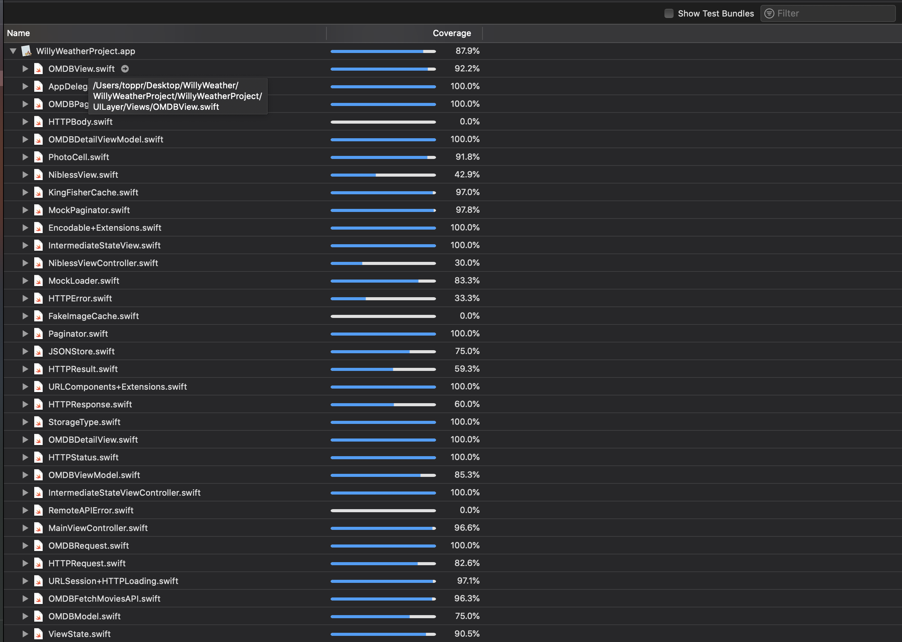

## 1. WillyWeather Assignment

Assignment by [Amandeep](mailto:amandeep.saluja21@gmail.com).

## 2. Requirements
- iOS 11.4+
- Tested on iOS 13 Simulator
- [Xcode 11.6+]

## 3. Getting Started
- Pod Install
- Open `WillyWeatherProject.xcworkspace` in Xcode

## 4. Problem Statements
[Problem Statements](docs/problem_statement.pdf)

## 5. Swift
This project is build using Swift 5.

## 6. 3rd Party
- [Kingfisher](https://github.com/onevcat/Kingfisher)

## 7. Unit/UI Test case
 - Test coverage is 87.9%
 - There are tests to tests all of the view model view states.
 - There are tests to test the pagination logic.
 - There are tests for networking and caching.
 - There are basic UI tests for navigation logic.
 
 

## 8. Architecture
In this project, I'm using **MVVM** architecture. Lots of stuff is borrowed from **Clean Architecture** we have layers for Networking, Caching and Pagination. Repository pattern is used to abstract the actual datasource. Codeable & FileManager are used for caching. Views are created in code. `View controller containment` is used to handle different view states. `DI and Protocols` are heavily used. The idea is to make unit testing easy peasy and also to be able to **swap the implementations** whenever without massively refactoring the code. 

## 9. API
- [OMDB API](https://www.omdbapi.com/)
